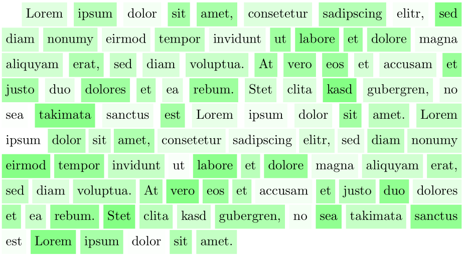

Python library to highlight words in a text, used e.g., in Natural Language Processing (NLP) tasks.

### Install via 
```
python -m pip install git+https://github.com/tigxy/texhighlight.git
```


### Usage
```
from texhighlight import highlight

highlight(text, opacities, "output.pdf", color="red")
```

By increasing the `max_opacity` attribute, lighter looking colors are also possible.


### Samples

